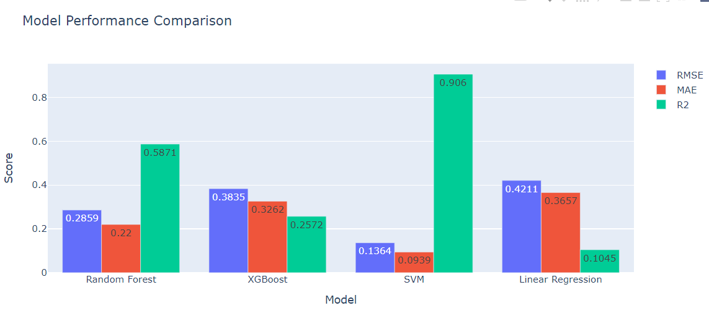
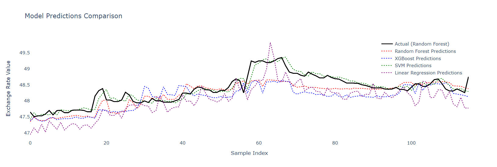

# Exchange Rate Prediction of the Egyptian Pound Against the USD

This project implements a machine learning solution to forecast the daily exchange rate between the Egyptian Pound (EGP) and US Dollar (USD). The model takes into account historical exchange rates, gold prices, and inflation rates to make one-day-ahead predictions.

## Project Overview

The system uses multiple models (Random Forest, XGBoost, SVM, and Linear Regression) to predict exchange rates, automatically selecting the best performing model based on evaluation metrics. From the performance comparison chart, the Support Vector Machine (SVM) model shows the best performance with:
- Lowest RMSE (0.1364)
- Lowest MAE (0.0939)
- Highest R² score (0.906)
- 




## Installation

1. Clone the repository:
```bash
git clone https://github.com/yourusername/egp-usd-prediction.git
cd egp-usd-prediction
```

2. Create a virtual environment (recommended):
```bash
python -m venv venv
source venv/bin/activate  # On Windows: venv\Scripts\activate
```

3. Install dependencies:
```bash
pip install -r requirements.txt
```


## Data Sources

The project uses three main data sources:

1. [Gold Prices Dataset](https://www.kaggle.com/datasets/mohamedmagdy11/egypt-gold-prices-daily-updated) - Daily gold prices in Egypt
2. [Exchange Rates Historical Data](https://www.cbe.org.eg/en/economic-research/statistics/exchange-rates/historical-data) - From Central Bank of Egypt
3. [Inflation Rates Historical Data](https://www.cbe.org.eg/en/economic-research/statistics/inflation-rates/historical-data) - From Central Bank of Egypt

## Usage Guide

### 1. Feature Engineering

You can customize feature engineering by modifying the configuration:

```python
from src.feature_engineering.feature_config import FeatureConfig
from src.feature_engineering.feature_engineer import FeatureEngineer

# Custom configuration
config = FeatureConfig(
    lag_days=[1, 3, 5, 7],           # Historical values to consider
    rolling_windows=[7, 14, 30],      # Moving average windows
    ema_spans=[3, 7, 14, 30]         # Exponential moving average spans
)

# Create engineer with custom config
engineer = FeatureEngineer(config)

# Generate features
X, y = engineer.prepare_forecast_data(
    df_exchange=exchange_df,
    df_gold=gold_df,
    df_inflation=inflation_df,
    target_days=1
)
```

### 2. Model Training and Selection

Train and evaluate multiple models to find the best performer:

```python
from src.modeling.train import run_model_comparison

# Train and compare all models
best_model_name, best_model, best_metrics = run_model_comparison(X, y)
```

### 3. Making Predictions

After training, use the best model for predictions:

```python
# Load the saved best model
from src.modeling.predictor import ModelPredictor

predictor = ModelPredictor('models/SVM_rmse0.1364_r20.9060.joblib')
predictions = predictor.predict(new_data)
```

## Model Performance

The project evaluates models using three metrics:
- RMSE (Root Mean Square Error)
- MAE (Mean Absolute Error)
- R² Score (Coefficient of Determination)

Based on these metrics, the SVM model currently shows the best performance for one-day-ahead predictions.
--------

